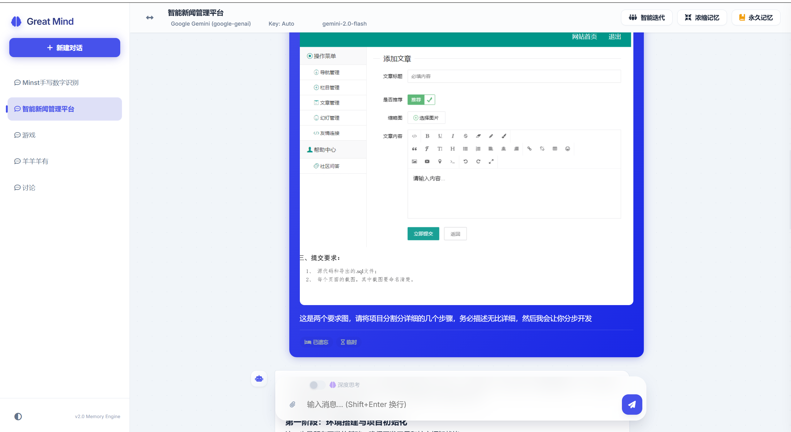
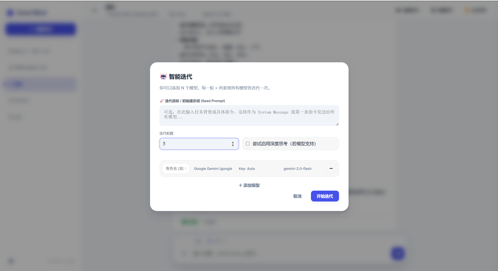
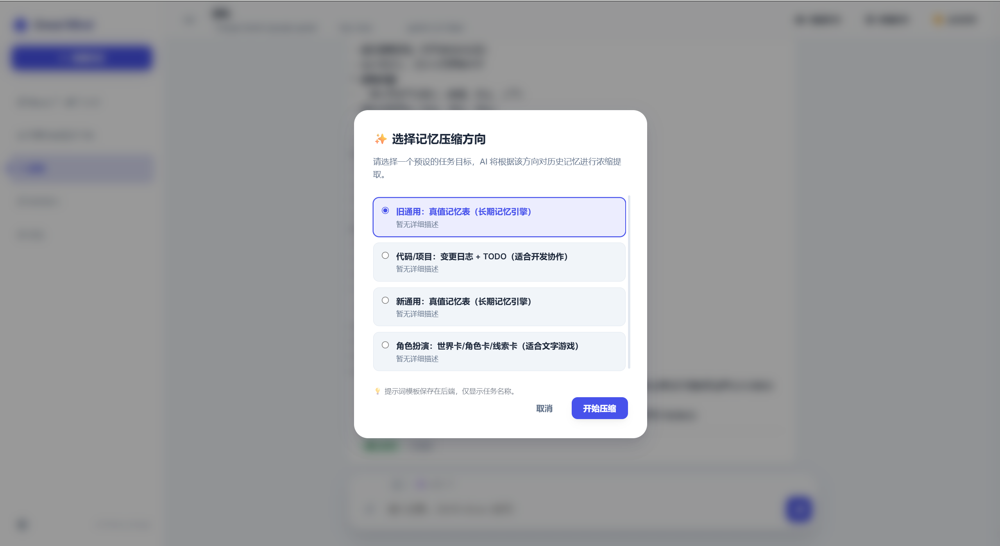
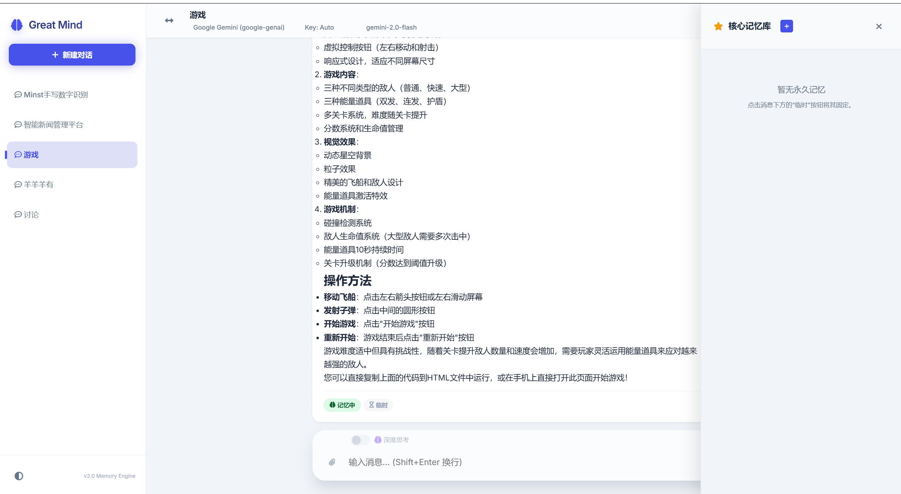
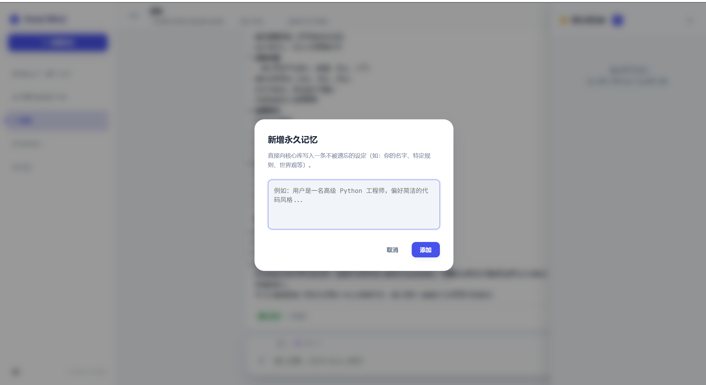
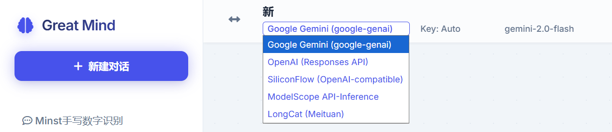
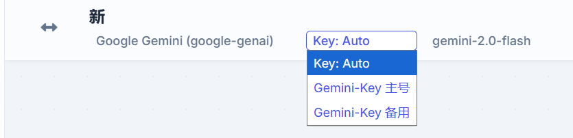
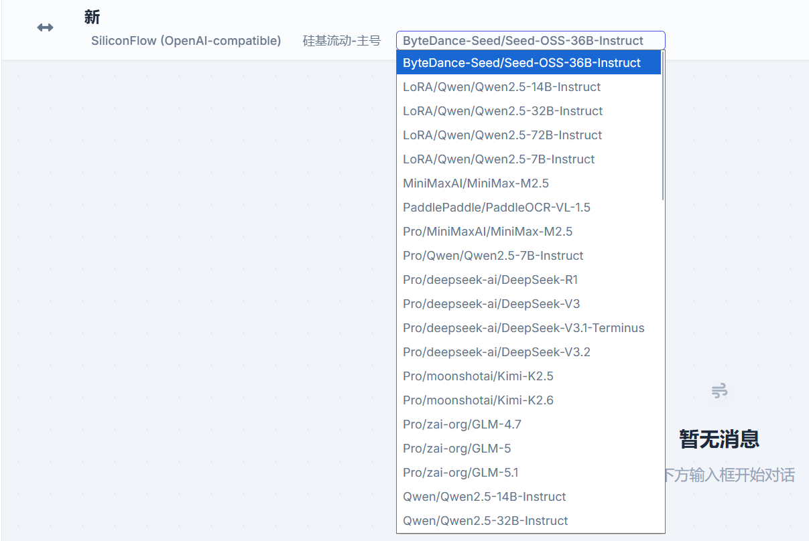

<p align="center">
  
</p>

<h1 align="center">Great Mind - Memory Console</h1>

<p align="center">
  <b>多模型 AI 对话平台</b> · 双层级记忆管理 · 智能压缩引擎 · 多模型协作讨论
</p>

<p align="center">
  
  
  
</p>

---

## 目录

- [功能特性](#功能特性)
- [界面预览](#界面预览)
- [技术架构](#技术架构)
- [项目结构](#项目结构)
- [快速开始](#快速开始)
- [使用指南](#使用指南)
  - [对话功能](#对话功能)
  - [记忆系统](#记忆系统)
  - [多模型协作讨论](#多模型协作讨论)
  - [模型与密钥管理](#模型与密钥管理)
- [API 接口](#api-接口)
- [环境变量](#环境变量)
- [安全设计](#安全设计)
- [注意事项](#注意事项)
- [许可证](#许可证)

---

## 功能特性

### 核心能力

| 功能 | 描述 |
|------|------|
| **多厂商 LLM 接入** | 统一接口支持 Google Gemini、OpenAI、SiliconFlow、ModelScope、LongCat 五大平台，一键切换 |
| **双层级记忆系统** | 临时记忆（会话级上下文）+ 永久记忆（跨会话持久化知识），消息级别精确控制 |
| **记忆压缩引擎** | 基于 LLM 的递归摘要压缩，4 种预设模板覆盖通用对话、编程协作、角色扮演等场景 |
| **多模型协作讨论** | 指定 N 个不同模型参与，按轮次接力对话，支持自定义角色名与深度思考模式 |
| **思考/推理模式** | 自动检测模型推理能力（白名单 + 关键词双机制），适配 DeepSeek R1、Gemini Thinking、QwQ 等推理模型 |
| **流式响应 (SSE)** | 实时流式输出，思考过程与正文分离展示 |
| **多模态附件** | 支持图片上传与文本文件内联，自动 Base64 编码发送至模型 |
| **消息重生成** | 对单条 AI 回复重新生成，自动截取该消息之前的上下文 |

### 会话管理

- 多会话独立存储（每个会话一个 JSON 文件，互不干扰）
- 会话创建 / 重命名 / 删除
- 消息级别记忆开关 — 逐条启用（记忆中）或遗忘（已遗忘）
- 永久记忆实时编辑、新增与删除
- 会话列表侧边栏，快速切换

---

## 界面预览

### 主界面 — 对话与项目管理

<p align="center">
  
</p>

主界面分为三栏布局：
- **左侧**：会话导航栏，支持新建/切换/管理多个独立对话
- **中间**：对话内容区，支持富文本渲染（代码高亮、数学公式、图片展示）
- **底部**：输入区域，含深度思考开关与附件上传

### 多模型协作讨论

<p align="center">
  
</p>

智能迭代功能允许添加多个不同平台的模型参与协作，设置迭代轮数与初始提示词（Seed Prompt），每个模型可看到前序模型的输出并接力回复。

### 记忆压缩

<p align="center">
  
</p>

提供 4 种压缩预设：
- **旧通用 / 新通用**：真值记忆表（档案 + 定案 + 任务三段式）
- **代码/项目**：变更日志 + TODO，适合开发协作
- **角色扮演**：世界卡 + 角色卡 + 线索卡，适合文字游戏与 RPG

### 永久记忆库

<p align="center">
  
</p>

右侧核心记忆库侧边栏展示所有永久记忆条目，可随时新增、编辑或删除，永久记忆将作为 System Instruction 注入每次对话。

<p align="center">
  
</p>

### 模型与厂商切换

<p align="center">
  
</p>

顶部导航栏支持一键切换 AI 服务厂商，下拉菜单包含所有已配置的平台。

### API 密钥管理

<p align="center">
  
</p>

每个平台支持配置多个 API Key，可选择手动指定或自动轮询（Auto）分配。

### 模型列表

<p align="center">
  
</p>

从远端 API 动态拉取可用模型列表，包括免费与付费模型（如 SiliconFlow 的 Pro 系列），按名称排序展示。

---

## 技术架构

### 架构概览

```
┌──────────────────────────────────────────────────────┐
│                   Frontend (SPA)                      │
│              HTML / CSS / Vanilla JS                  │
│     highlight.js · KaTeX · Font Awesome               │
└─────────────────────┬────────────────────────────────┘
                      │ HTTP / SSE (Server-Sent Events)
┌─────────────────────▼────────────────────────────────┐
│                  Flask Backend                        │
│  ┌─────────────┐  ┌──────────────┐  ┌────────────┐ │
│  │  app.py      │  │  appnb.py    │  │  Security  │ │
│  │  (路由+逻辑)  │  │  (Notebook)  │  │  (校验+锁) │ │
│  └──────┬───────┘  └──────┬───────┘  └────────────┘ │
│         │                 │                          │
│  ┌──────▼─────────────────▼──────────────────────┐  │
│  │           llm_providers.py                     │  │
│  │    ┌──────────┐  ┌───────────────────────┐   │  │
│  │    │KeyManager │  │   Provider 抽象层       │   │  │
│  │    │(多Key轮询) │  │ Google · OpenAI        │   │  │
│  │    └──────────┘  │ SiliconFlow · ModelScope │   │  │
│  │                  │ LongCat (美团 LongCat)   │   │  │
│  │                  └───────────────────────┘   │  │
│  └─────────────────────────────────────────────┘  │
│         │              │              │              │
│  ┌──────▼──────┐ ┌─────▼──────┐ ┌───▼────┐ ┌────▼──┐│
│  │  Google     │ │  OpenAI    │ │Silicon │ │Model  ││
│  │  Gemini API │ │  GPT API   │ │ Flow   │ │ Scope ││
│  └─────────────┘ └────────────┘ └────────┘ └───────┘│
└──────────────────────────────────────────────────────┘
                      │
         ┌────────────▼────────────┐
         │    Local Storage         │
         │  chats_data/ (JSON)     │
         │  uploads/   (附件)      │
         └─────────────────────────┘
```

### Provider 抽象层设计

`llm_providers.py` 采用策略模式，所有 LLM 厂商统一实现 `LLMProvider` 接口：

```python
class LLMProvider:
    def list_models(self) -> List[Dict[str, str]]: ...
    def generate_text(self, model, prompt, system) -> str: ...
    def stream_chat(self, model, messages, system, upload_folder, options) -> Iterator[StreamEvent]: ...
```

| Provider 类 | 适配平台 | 通信方式 | 流式协议 |
|-------------|----------|----------|----------|
| `GoogleGenAIProvider` | Google Gemini | google-genai SDK | SDK Stream |
| `OpenAIProvider` | OpenAI | openai SDK | SDK Stream |
| `SiliconFlowProvider` | 硅基流动 | HTTP (requests) | SSE |
| `ModelScopeProvider` | 魔搭社区 | HTTP (requests) | SSE |
| `LongCatProvider` | 美团 LongCat | HTTP (requests) | SSE |

其中 SiliconFlow、ModelScope、LongCat 均继承自 `OpenAICompatibleChatProvider` 基类，共享请求构建、SSE 解析、字段白名单过滤等通用逻辑。

### 技术栈

| 层级 | 技术 | 用途 |
|------|------|------|
| 后端框架 | Flask | 路由、请求处理、SSE 推流 |
| AI SDK | google-genai, openai, requests | 多厂商 LLM 接入 |
| 前端 | 原生 HTML/CSS/JS | 单页应用 (SPA) |
| 代码高亮 | highlight.js | 对话中的代码块渲染 |
| 数学公式 | KaTeX | LaTeX 公式实时渲染 |
| 图标 | Font Awesome 6 | UI 图标 |
| 字体 | Inter + JetBrains Mono | 界面 + 代码字体 |
| 数据存储 | JSON 文件 | 会话历史持久化 |
| 并发控制 | threading.Lock | 读写锁、原子写入 |

---

## 项目结构

```
AIUse/
├── app.py                 # 主应用入口 — Flask 路由、业务逻辑、记忆管理
├── appnb.py              # Notebook 模式入口（功能与 app.py 一致，备用）
├── llm_providers.py       # 多厂商 LLM 抽象层 — Provider 接口、Key 管理、流式通信
├── templates/
│   └── index.html         # 前端单页应用 — 完整 UI、交互逻辑、Markdown 渲染
├── chats_data/            # 对话数据存储 — 每个 JSON 文件为一个独立会话
│   ├── Minst手写数字识别.json
│   ├── 智能新闻管理平台.json
│   └── ...
├── uploads/               # 附件文件存储 — MD5 命名防冲突
├── images/                # README 截图资源
└── README.md              # 本文件
```

---

## 快速开始

### 前置条件

- Python 3.9+
- 各平台 API Key（至少配置一个）

### 1. 克隆仓库

```bash
git clone https://github.com/your-username/AIUse.git
cd AIUse
```

### 2. 安装依赖

```bash
pip install flask google-genai openai requests
```

### 3. 配置 API Key

编辑 `llm_providers.py`，找到 `my_keys` 字典，填入你的 API 密钥：

```python
my_keys = {
    "google": [
        {"name": "Gemini 主号", "key": "YOUR_GOOGLE_API_KEY"},
    ],
    "openai": [
        {"name": "OpenAI 主号", "key": "sk-YOUR_OPENAI_KEY"},
    ],
    "siliconflow": [
        {"name": "硅基流动 主号", "key": "sk-YOUR_SILICONFLOW_KEY"},
    ],
    "modelscope": [
        {"name": "ModelScope 主号", "key": "YOUR_MODELSCOPE_TOKEN"},
    ],
    "longcat": [
        {"name": "LongCat 主号", "key": "YOUR_LONGCAT_KEY"},
    ],
}
```

> **多 Key 支持**：每个厂商可配置多个密钥，系统自动以 Round-Robin 策略轮询分配请求，均衡负载。

### 4. 启动服务

```bash
python app.py
```

默认监听 `0.0.0.0:5000`，浏览器访问：

- 本机：http://localhost:5000
- 局域网：http://<你的局域网IP>:5000

启动后即可开始使用。

---

## 使用指南

### 对话功能

1. **新建对话**：点击左侧导航栏的「+ 新建对话」按钮
2. **选择模型**：在顶部导航栏切换厂商和模型
3. **发送消息**：在底部输入框输入内容，按 Enter 发送（Shift+Enter 换行）
4. **上传附件**：点击输入框旁的附件按钮上传图片或文件
5. **深度思考**：开启输入框左侧的「深度思考」开关，推理模型将展示思考过程
6. **重新生成**：对不满意的单条 AI 回复，点击重新生成按钮（仅使用该消息之前的上下文）

### 记忆系统

#### 三种消息状态

| 状态 | 标签 | 行为 |
|------|------|------|
| **记忆中（临时）** | 绿色「临时」 | 参与对话上下文，可被记忆压缩处理 |
| **已遗忘** | 灰色「已遗忘」 | 不参与对话，不参与压缩，但仍保留在历史中 |
| **永久记忆** | 金色标签 | 作为 System Instruction 注入每次请求，不会被压缩或遗忘 |

#### 记忆压缩

点击顶部「浓缩记忆」按钮：

1. 选择压缩预设（通用/编程/角色扮演等）
2. AI 将读取所有「记忆中」的临时消息和旧摘要
3. 生成结构化压缩结果（档案/定案/任务三段式）
4. 确认后，被压缩的消息标记为「已遗忘」，压缩结果存入新的摘要

#### 永久记忆管理

- 点击右侧「核心记忆库」侧边栏的 **+** 按钮新增
- 将任意临时消息点击「临时」按钮切换为「永久记忆」（记忆类型升级为 Type=2）
- 永久记忆可实时编辑内容或删除
- 永久记忆在每次对话时作为 System Prompt 注入，适合存储：角色设定、核心偏好、世界观、项目约束等

### 多模型协作讨论

点击顶部「智能迭代」按钮：

1. **设置 Seed Prompt**：输入任务背景或具体指令，作为所有模型的初始输入
2. **添加模型**：可添加不同平台、不同模型的参与者（如 Gemini + DeepSeek + Qwen）
3. **设置轮数**：决定每个模型发言几轮（如 2 轮 × 3 模型 = 共 6 次迭代）
4. **启用深度思考**：勾选后推理模型会展示思考过程
5. **自定义角色名**：为每个参与者设置显示名称（如「架构师」「评审员」），增强 Roleplay 沉浸感

迭代过程中，每个模型可以看到之前所有模型的输出，实现真正的多视角协作。

### 模型与密钥管理

- **切换厂商**：顶部下拉菜单选择 AI 服务平台
- **切换模型**：每个平台可从远端 API 动态拉取可用模型列表
- **选择密钥**：支持「Auto」（自动轮询）或手动指定某个 Key
- **密钥命名**：每个 Key 可自定义显示名称，方便管理

---

## API 接口

后端提供以下 RESTful API：

| 方法 | 路径 | 功能 |
|------|------|------|
| `GET` | `/` | 主页面 |
| `GET` | `/api/list_chats` | 获取所有会话列表 |
| `POST` | `/api/chat` | 流式对话（SSE） |
| `POST` | `/api/get_history` | 获取指定会话的历史记录 |
| `POST` | `/api/toggle_memory` | 切换消息记忆状态 |
| `POST` | `/api/update_message` | 编辑单条消息内容 |
| `POST` | `/api/delete_message` | 删除单条消息 |
| `POST` | `/api/summarize_memory` | 执行记忆压缩（生成提案） |
| `POST` | `/api/confirm_summary` | 确认记忆压缩结果 |
| `POST` | `/api/add_permanent_memory` | 新增永久记忆 |
| `GET` | `/api/get_permanent_memory` | 获取永久记忆列表 |
| `POST` | `/api/regenerate_message` | 重新生成单条 AI 回复（SSE） |
| `POST` | `/api/ai_discuss` | 多模型协作讨论（SSE） |
| `GET` | `/api/get_models` | 获取指定平台的模型列表 |
| `GET` | `/api/get_providers` | 获取所有已注册的厂商列表 |
| `GET` | `/api/get_api_keys` | 获取指定平台的密钥元信息 |
| `GET` | `/api/get_model_capabilities` | 检测模型是否支持思考模式 |
| `GET` | `/api/memory_summary_presets` | 获取记忆压缩预设列表 |
| `POST` | `/api/rename_chat` | 重命名会话 |
| `POST` | `/api/delete_chat` | 删除会话 |
| `GET` | `/uploads/<filename>` | 访问上传的附件文件 |

---

## 环境变量

| 变量名 | 默认值 | 说明 |
|--------|--------|------|
| `MAX_UPLOAD_BYTES` | `10485760` (10MB) | 单个附件最大字节数 |
| `MAX_ATTACHMENT_COUNT` | `8` | 单次消息最大附件数 |

---

## 安全设计

| 措施 | 实现 |
|------|------|
| **文件名校验** | 正则过滤非法字符、Windows 保留名、控制字符、路径穿越 (`..` / `\` / `/`) |
| **附件限制** | 单文件 10MB 上限、单次 8 个附件上限、Base64 严格校验 |
| **路径隔离** | 附件路径强制归一化 + 前缀匹配，防止目录穿越攻击 |
| **原子写入** | 先写临时文件 (`.tmp`)，再 `os.replace` 原子替换，防止写入中断导致数据损坏 |
| **JSON 损坏恢复** | 损坏的 JSON 文件自动隔离为 `.corrupt`，返回空列表而非崩溃 |
| **线程安全** | 全局文件锁 (`file_lock`) + 按 Chat ID 的细粒度读写锁，防止并发读写冲突 |
| **死锁预防** | 重命名操作按字典序加锁，避免双锁死锁 |

---

## 注意事项

> **安全警告**：请勿将包含真实 API Key 的代码推送到公开仓库。提交前务必将 `llm_providers.py` 中的密钥替换为占位符，或改用环境变量管理。
>
> **推荐做法**：
> ```python
> import os
> my_keys = {
>     "google": [{"name": "Gemini", "key": os.environ.get("GOOGLE_API_KEY", "")}],
>     # ...
> }
> ```

- 对话数据以 JSON 文件存储在 `chats_data/` 目录，可直接备份或迁移
- 附件存储在 `uploads/` 目录，以 MD5 哈希命名，相同文件不重复存储
- `appnb.py` 为备用入口（Notebook 模式），功能与 `app.py` 完全一致

---

## 许可证

MIT License
